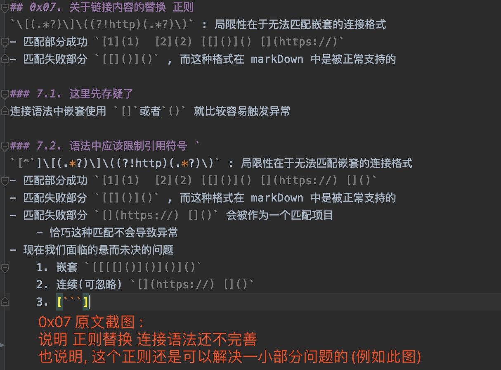

模仿自 : https://github.com/Sep0lkit/git-issues-blog 

## 0x00. 进度
1. 尝试直接在本地创建 yaml 文件并设置 py 文件与之关联。
    - 但是上传代码后 actions 列表中没有任何内容
2. 通过 GitHub 引导创建一个 yaml 文件后 actions 中成功出现合法 action
    - pull 到本地， 删除 GitHub 创建的 yaml 再次 push ， 观察到 actions 列表中的 actions 并没有消失
    - 恢复刚删除的 yaml 文件
    - 拷贝一个副本， 修改 yaml 中关于 action 命名代码， 执行 push
        - 重新点击 Actions 标签， 即可看到新的 action
3. 所以接下来我们需要了解语法细节了，因为自托管的 action ，没有出现在 Actions 列表中，也没有执行
4. 现在 github-host 可以运行，self-host 的无法运行这个问题需要解决，否则调试不方便
    - 现象是 self-host 的都在队列中但是不执行
    - 尝试到本地日志文件查找端倪
        - 日志文件名字为 ： `Runner_20200409-080001-utc` 
        - 定位字段之后的日志即为异常：`[2020-04-09 12:38:55Z WARN GitHubActionsService] Retrieving an AAD auth token took a long time (2.1094582 seconds)`
        - 这个异常是在执行 [再次测试 self-host](https://github.com/TomGarden/TomGitActions/actions/runs/74114980) 的时候出现的
    - 别忘了更新[自己的提问帖](https://github.community/t5/GitHub-Actions/self-host-block-on-Starting-your-workflow-run/m-p/53309/highlight/false#M8781)
    - 关于在 github-host 中 `git log` 只能获取一行内容问题的解决 [☞](https://github.community/t/github-actions-git-log-only-output-one-line/115487)
    - 尝试手动下载文件，文件下载位置应该是错误了，这么做无效
    - 尝试手动下载并下载旧版本重新安装新版本后再试一次

## 0x01. 参数释义
- jobs.<job_id>.steps.uses
- {owner}/{repo}@{ref}

```
steps:    
  - uses: actions/setup-node@74bc508 # Reference a specific commit
  - uses: actions/setup-node@v1      # Reference the major version of a release   
  - uses: actions/setup-node@v1.2    # Reference a minor version of a release  
  - uses: actions/setup-node@master  # Reference a branch
*****************************************************************************
steps:    
  - uses: TomGarden/TomGitActions@74bc508 # Reference a specific commit
  - uses: TomGarden/TomGitActions@v1      # Reference the major version of a release   
  - uses: TomGarden/TomGitActions@v1.2    # Reference a minor version of a release  
  - uses: TomGarden/TomGitActions@master  # Reference a branch
```

## 0x02. 快链
- [任务记录追踪](https://trello.com/b/5PH6gxbZ/队列)
- [自托管](https://help.github.com/en/actions/hosting-your-own-runners/about-self-hosted-runners)
- [Docker](https://docs.docker.com/engine/reference/builder/)
- [self-host 使用 docker 只支持 Linux 平台](https://help.github.com/cn/actions/building-actions/creating-a-docker-container-action)
- [shell 教程](https://www.gnu.org/software/bash/manual/)
    - 《linux shell脚本攻略》
- [Mac 换源](https://lug.ustc.edu.cn/wiki/mirrors/help/brew.git)
    - [Mac 换源 2](https://www.zhihu.com/question/31360766)
- [Python](https://docs.python.org/zh-cn/3/)
    - [python 代码风格指南](https://www.python.org/dev/peps/pep-0008/)
        - [某个中文版本](https://pythonguidecn.readthedocs.io/zh/latest/writing/style.html#pep-8)
    - [PyGithub 开发文档](https://pygithub.readthedocs.io/en/latest/)
    - [对类中的 self 的理解](https://docs.python.org/zh-cn/3/tutorial/classes.html)
- [关于 GitHub 的访问权限](https://developer.github.com/apps/about-apps/)
- [关于 git 学习 pro git 这个手册是真的不错](https://git-scm.com/book/zh/v2)
- [关于 git 操作](https://git-scm.com/docs):本项目着重用到的内容为
    - [git diff --raw](https://git-scm.com/docs/git-diff#Documentation/git-diff.txt---raw)
        - [（git diff --raw）Raw output format](https://git-scm.com/docs/git-diff#_raw_output_format)
      ```markdown
        git diff 操作是有方向的含义的，方向是以时间作为量度，下面列表的顺序就是操作顺序，也就是时间顺序
        - 在某个分支上不间断操作    ： 操作前的提交哈希为  hash-0
        1. 创建一个文件 oneFile   ： 操作对应哈希为 hash-1
        2. 修改文件 oneFile 内容  ： 操作对应哈希为 hash-2
        
        git diff --raw hash-2 hash-0
        - 得到的操作状态为 D 也就是说删除了文件 oneFile
      
        git diff --raw hash-0 hash-2
        - 得到的操作撞他爱为 A 也就是说创建了文件 oneFile
      
        默认的 git diff 获取的三个 哈希值自上而下的顺序是
        hash-2
        hash-1
        hash-0
      ```
- `git diff commit commit` 可以获取变化的文件这没问题 , 但是 commit 的顺序是时间相关的,所以 我们还要获取 commit 操作的时间
- `git log --pretty=format:"%h - %an, %ar : %s"` 可以帮我们了解关心的内容的格式化信息,这一点应该会很有帮助      
    

### 2.1. 限制须知
1. 在编码调试阶段我们不再在本地真正运行 host-actions 而是直接使用 PyGitHub 远程操作 GitHub 仓库
    - https://developer.github.com/v3/#rate-limiting
        - 对于使用基本身份验证或OAuth的API请求，您每小时最多可以进行5000个请求。
        - 对于未经身份验证的请求，速率限制允许每小时最多60个请求。 
    - [查看当前请求限制数据](https://pygithub.readthedocs.io/en/latest/github.html#github.MainClass.Github.rate_limiting)
        ```python
        rateLimiting = github_obj.rate_limiting
        print(rateLimiting)
        ```


## 0x03. 自托管错误列表
- paths 节点写的路径名错误导致 GitHub 站点不展示我们的工作流，这个错误没有任何异常，一句一句测出来的。
- 当设置了 paths 当提交没有执行应该是 paths 中的文件没有变化，如果path 中的文件发生变化才会再次执行
- 替换 uses 字段为 `TomGarden/TomGitActions@master` 之后自托管阻塞， GitHub-host 失败
    - 尝试修改项目为公开再试仍然报错
        `
- Could not find file '/home/runner/work/_actions/_temp_17ef85be-8371-4695-be54-0df83e36a30f/_staging/TomGarden-TomGitActions-c276e39/venv/bin/python3`
    - 这时在使用 idea 创建的 Python 项目的文件夹，把这个文件忽略掉就没问题了
    
- 自托管工作流不执行可以到本地日志文件查找问题
    - [Reviewing a job's log file](https://help.github.com/cn/actions/hosting-your-own-runners/monitoring-and-troubleshooting-self-hosted-runners#reviewing-a-jobs-log-file)

- 如果self-actions 无法运行，并且不包从，可查看 /github_action/actions-runner/_diag/*.log 获取异常原因
    - 有两次都是因为 actions runner 自动更新失败导致的，这时候可以手动下载更新后再试
    
- 身处中国如果出现异常 `[Errno 61] Connection refused` 可以调整本地代理为全局试试


## 0x04. 参考项目可优化方向
1. 文件格式自动识别并读取
2. [\\1](https://raw.githubusercontent.com/TomGarden/TomGitActions/master/../posts/\\2)
3. 文章 header footer 中的字符串内容可以发挥 `parse_issue_tpl`
4. 国际化
5. 使用文档，应该分为两部分
    - 对于某些配置项 github action 对操作着来说是透明的他也可以做出喜欢的操作实现想要的功能
    - 某些配置是以了解 github action 为前提的
6. 上一个 action 还没有完成的时候又发起了新的 action 会发生什么
7. 文章内目录，所有文章总录
8. 文件中可以设定专门的配置语句位置，可以不配置，但是如果项配置就可以配置
9. 一切锦上添花的功能都应该是可插拔的
10. 尽最大努力控制学习成本
11. git diff 的一般操作已经可以 把控， 
12. git merge 后的 diff 操作尚需详究，待到测试流程完善
13. Blog 应该是有浓重个人色彩的存在, 我们应该有一个配置文件来输出随机的文字, 这个文件就是随机的信息池
14. git 文档中的某些术语还需要辨析
     - tree / index / ...
15. 对于用户代码回滚后的应对方式获取是可以通过不处理来处理的(再次提交内容或需可行)-细节有待详究
16. 应该允许设置 ignore , 对于被 ignore 标记的内容不做遍历和操作
17. 要展示异常信息的调用栈 raise 还可以深入探究
18. 日志模块仍需发力
19. 如果使用项目内的某个文件作为配置文件还尚可, 但是自主生成的操作数据还是放到不干预提交过程的地方比较舒服吧, 我们放在 issues 中或者新建分支是合适的, 那我们就放在 issues 中
20. 允许默认不配置 issues_file_dictionary 对应的 issue , 在这种情况下应该自助生成 , 而不是报异常
21. 日志色彩和格式暂时就放下吧
22. 关于删除指定 issue : gitHub api v3 暂时不支持此操作, V4 可以了, 这个问题放一放, 如果有必要在深入研究 
23. 图片路径替换需要确定
24. 页眉页脚需要确认


## 0x05. 关于测试
对于文件的修改
- *符合预期* modify_addition = 'A'
- *符合预期* modify_deletion = 'D'
- *未覆盖*  modify_copy = 'C'
- *未覆盖*  modify_modification = 'M'
- *未覆盖*  modify_renaming = 'R'
- *未覆盖*  modify_file_is_unmerged = 'U'
- *未覆盖*  modify_change_type = 'T'
- *未覆盖*  modify_unknown = 'X'


## 0x06. 关于 issue_ignore 字段的内容
- 目的是 : 操作者可以通过配置这一字段控制自己的发布的内容
- 手段是 : 模仿 [gitignore](https://git-scm.com/docs/gitignore)
- 效果是 : gitignore 所容纳规则的一个子集(没有完全实现 gitignore 的规则)

### 6.1. issue_ignore 规则(摘自 [gitignore](https://git-scm.com/docs/gitignore))
PATTERN FORMAT
- The slash / is used as the directory separator. 
  Separators may occur at the beginning, middle or end of the .gitignore search pattern.
  - 斜杠(`/`)是文件路径分隔符. 斜杠(`/`)可能出现于匹配文本的开始,中间和结尾.
  
- If there is a separator at the beginning or middle (or both) of the pattern, 
  then the pattern is relative to the directory level of the particular .gitignore file itself. 
  Otherwise the pattern may also match at any level below the .gitignore level.
  - 如果斜杠(`/`)在开始或中间(或者开始和中间都出现), 那么匹配文本和 .gitignore 所在路径相关(只匹配该路径下(一层)的内容).
    否则匹配该路径下任意子集的内容
  
- If there is a separator at the end of the pattern then the pattern will only match directories, 
  otherwise the pattern can match both files and directories.
  - 如果斜杠在匹配字符串的末尾将仅匹配文件夹, 其他情况匹配文件和文件夹.
  
- An asterisk "*" matches anything except a slash. 
  The character "?" matches any one character except "/". 
  The range notation, e.g. [a-zA-Z], can be used to match one of the characters in a range. 
  See fnmatch(3) and the FNM_PATHNAME flag for a more detailed description.
  - 星号(`*`)匹配除斜杠(`/`)之外的任何内容.
    问号(`?`)匹配除斜杠(`/`)之外的任何一个字符.
    
与完整路径名匹配的模式中的两个连续星号（`“ **”`）可能具有特殊含义：
- 前导`“ **”`后跟斜杠表示在所有目录中均匹配。例如，`“ **/foo”`与文件`“ foo”`相同的任何位置都匹配文件或目录`“ foo”`。
  `“ **/foo/bar”` bar会在目录`“ foo”` 正下方的任何位置匹配文件或目录“ ”。
- 尾部的`“ /**”`与内部的所有内容匹配。例如，`“ abc/**”`将目录`“ abc”` 内的所有文件（相对于`.gitignore`文件位置）以无限深度进行匹配。
- 斜杠后跟两个连续的星号，然后斜杠匹配零个或多个目录。例如，`“ a/**/b”`匹配`“ a/b”`，`“ a/x/b”`，`“ a/x/y/b”`等。
- 其他连续的星号被视为常规星号，并将根据之前的规则进行匹配。
    

### 6.2. `6.1` 内容略显复杂我们尝试简化下
我们能操作的内容前提为:
1. 文件完整路径
2. 忽略规则

我们可以操作的实际内容为:
1. 我们的匹配规则包含任意字符其中
    - 斜杠(`/`)视为路径
    - 星号(`*`)视为除斜杠(`/`)外的任意不限长度字符串
    - 问号(`?`)视为除斜杠(`/`)外的任意单个字符
    
示例:
0. 直接指定,完全限定
1. 不想匹配某个路径
2. 不想匹配某种类型的文件
3. 不想匹配某种命名的文件
4. 不想匹配某个名称的文件夹

'/'开头表示从根路径开始
'directory/'表示不限路径深度的文件夹
'string'表示不限路径深度的不限文件/文件夹的 

### 6.3. 现在给出例子

一个文件夹(这个文件夹可能出现在路径中的任何位置) directory/
- ^directory/|/directory/

一个文件(这个文件可能出现在路径中的任何位置) fileName
- ^fileName/|/fileName/|/fileName$

星号(`*`)表示任何不含有 '/' 的连续字符串  prefix`*`suffix
- prefix((?!/).)*suffix

问号(?)表示非 '/' 的任意字符 prefix?suffix
- prefix((?!/).)suffix

`*` 表示本身不表示特殊字符的匹配  prefix`\*`suffix
- prefix((?!\\)\*)suffix
- prefix(\*)suffix

### 6.4. 小结一
我们能指定忽略的内容无非就是
- `文件`和`文件夹`
- 它们出现的位置可能是任意位置
- 它们的名字可能包含有特殊字符(仅限 `?` 和 `*` , 其他字符不认为是含有特殊意义的字符)
  - `*` 的用意是用于匹配若干连续个非 `/` 字符
    - 如果要匹配 `*` 使用 `\*`
  - `?` 的用意是匹配单个非 `/` 字符
    - 如果要匹配 `?` 使用 `\?`
    
总的来说还是有很大局限性, 更适合直接录入正则表达式

但是直接录入表达式有使问题变得更复杂

### 6.5. 小结二
- 正则匹配如果无法过滤关键字会导致问题更加复杂和不可控
- 所以我们只提供固定路径的方式把 , 匹配字符从根目录开始, 匹配即忽略
- 这个配置文件完全是用户单向操纵, 代码只是读取, 所以可以放在本地维护(不同于 issues)


## 0x07. 关于链接内容的替换 正则
`\[(.*?)\]\((?!http)(.*?)\)` : 局限性在于无法匹配嵌套的连接格式
- 匹配部分成功 `[1](1)  [2](2) [[]()]() [](https://)`
- 匹配失败部分 `[[]()]()` , 而这种格式在 markDown 中是被正常支持的

### 7.1. 这里先存疑了
连接语法中嵌套使用 `[]`或者`()` 就比较容易触发异常

### 7.2. 语法中应该限制引用符号 `
`[^`]\[(.*?)\]\((?!http)(.*?)\)` : 局限性在于无法匹配嵌套的连接格式
- 匹配部分成功 `[1](1)  [2](2) [[]()]() [](https://) []()`
- 匹配失败部分 `[[]()]()` , 而这种格式在 markDown 中是被正常支持的
- 匹配失败部分 `[](https://) []()` 会被作为一个匹配项目
    - 恰巧这种匹配不会导致异常
- 现在我们面临的悬而未决的问题
    1. 嵌套 `[[[[]()]()]()]()`
    2. 连续(可忽略) `[](https://) []()`
    3. [```]
    



 
